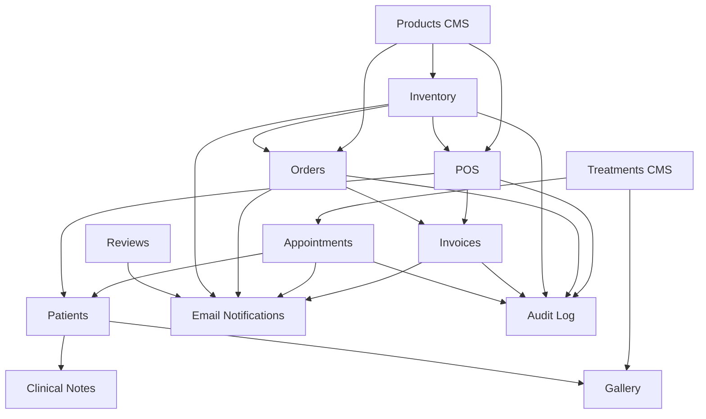

# 03 — Modules & Permissions

## Brimish Skin Care Clinic — Module Breakdown, Permission Matrix & Information Architecture

**Version:** 1.0.0-draft
**Date:** 2026-10-01

---

## 1. Module Breakdown

### 1.1 Public Website Modules

| Module | Description | Key Features |
|--------|-------------|-------------|
| **Home** | Landing page | Hero section, featured treatments, testimonials snippet, CTAs |
| **About** | Clinic information | Doctor profile, clinic story, certifications, mission |
| **Treatments** | Treatment catalog | Categorized list, detail pages, pricing, duration, booking CTA |
| **Products** | Product catalog | Categorized list, detail pages, pricing, add-to-cart |
| **Gallery** | Before/After showcase | Interactive comparison slider, treatment categories, consent-verified |
| **Reviews** | Patient testimonials | Approved reviews display, review submission form |
| **Contact** | Contact information | Clinic address, map embed, phone, email, contact form |
| **Booking** | Appointment form | Name, phone, treatment selection, date/time, message |
| **Ordering** | Product checkout | Cart, guest checkout, delivery/pickup, order confirmation |

### 1.2 Dashboard Modules

| Module | Description | Depends On |
|--------|-------------|------------|
| **Dashboard Home** | Overview/summary statistics | All modules |
| **Appointments** | Booking management, calendar view | Treatments, Patients |
| **Patients** | Patient records, history, clinical notes | Appointments, POS, Invoices, Gallery |
| **POS** | Point of sale terminal | Products, Patients, Inventory, Invoices |
| **Invoices** | Invoice management, print, PDF, email | POS, Orders, Patients |
| **Inventory** | Stock management, alerts | Products |
| **Orders** | Online order management | Products, Inventory, Invoices |
| **Reviews** | Review moderation | — |
| **Gallery** | Before/After management | Patients, Treatments |
| **Treatments (CMS)** | Treatment content management | — |
| **Products (CMS)** | Product content + inventory management | Inventory |
| **Reports** | Business analytics, CSV exports | All modules |
| **Settings** | Clinic settings, staff management | — |

---

## 2. Permission Matrix

### Legend
- ✅ **Full Access** — Can view, create, edit, delete
- 👁️ **View Only** — Can view but not modify
- 🔒 **Restricted** — No access
- ⚡ **Partial** — Limited operations (specified in notes)

### 2.1 Dashboard Access Matrix

| Module / Action | Super Admin (Doctor) | Receptionist | Notes |
|-----------------|---------------------|--------------|-------|
| **Dashboard Home** | ✅ Full stats | ⚡ Operational stats only | Receptionist sees today's appointments, pending orders, low stock. Doctor sees all + revenue, financial summaries. |
| **Appointments** | | | |
| ├ View all appointments | ✅ | ✅ | |
| ├ Create appointment | ✅ | ✅ | |
| ├ Confirm/reschedule | ✅ | ✅ | |
| ├ Cancel appointment | ✅ | ✅ | |
| ├ Mark completed/no-show | ✅ | ✅ | |
| └ Delete appointment | ✅ | 🔒 | Soft delete only, admin only |
| **Patients** | | | |
| ├ View patient list | ✅ | ✅ | |
| ├ View patient profile | ✅ | ⚡ | Receptionist cannot see clinical notes |
| ├ Create patient | ✅ | ✅ | |
| ├ Edit patient info | ✅ | ✅ | |
| ├ View visit history | ✅ | ✅ | |
| ├ View purchase history | ✅ | ✅ | |
| ├ Clinical notes — View | ✅ | 🔒 | **Doctor only** |
| ├ Clinical notes — Create/Edit | ✅ | 🔒 | **Doctor only** |
| ├ Before/After photos — Upload | ✅ | ✅ | |
| ├ Before/After photos — Manage consent | ✅ | 🔒 | Doctor authorizes publication |
| └ Delete patient | ✅ | 🔒 | Soft delete, admin only |
| **POS** | | | |
| ├ Create sale | ✅ | ✅ | |
| ├ Add items to cart | ✅ | ✅ | |
| ├ Apply discount | ✅ | ⚡ | See BD-06: may require threshold limit |
| ├ Process payment | ✅ | ✅ | |
| ├ Complete sale | ✅ | ✅ | |
| ├ Void/cancel sale (before completion) | ✅ | ✅ | |
| └ Void completed sale | ✅ | 🔒 | Admin only — creates credit note |
| **Invoices** | | | |
| ├ View invoices | ✅ | ✅ | |
| ├ Print/PDF invoice | ✅ | ✅ | |
| ├ Email invoice | ✅ | ✅ | |
| ├ Reprint invoice | ✅ | ✅ | |
| └ Void invoice | ✅ | 🔒 | Admin only |
| **Inventory** | | | |
| ├ View inventory | ✅ | ✅ | |
| ├ Add product | ✅ | 🔒 | |
| ├ Edit product | ✅ | 🔒 | |
| ├ Stock adjustments | ✅ | ⚡ | Receptionist can record received stock; admin approves adjustments |
| ├ View movement history | ✅ | ✅ | |
| ├ View purchase prices | ✅ | 🔒 | Cost/margin data is admin-only |
| └ Delete product | ✅ | 🔒 | Soft delete, admin only |
| **Orders** | | | |
| ├ View orders | ✅ | ✅ | |
| ├ Update order status | ✅ | ✅ | |
| ├ Cancel order | ✅ | ✅ | |
| └ Delete order | ✅ | 🔒 | Soft delete, admin only |
| **Reviews** | | | |
| ├ View pending reviews | ✅ | ✅ | |
| ├ Approve/reject reviews | ✅ | ✅ | |
| └ Delete reviews | ✅ | 🔒 | |
| **Gallery (B/A)** | | | |
| ├ View all gallery items | ✅ | ✅ | |
| ├ Upload images | ✅ | ✅ | |
| ├ Set public/private | ✅ | 🔒 | Doctor controls publication |
| ├ Manage consent | ✅ | 🔒 | Doctor controls consent |
| └ Delete gallery items | ✅ | 🔒 | |
| **Treatments (CMS)** | | | |
| ├ View treatments | ✅ | ✅ | |
| ├ Create/Edit treatments | ✅ | 🔒 | |
| └ Delete treatments | ✅ | 🔒 | |
| **Products (CMS)** | | | |
| ├ View products (public details) | ✅ | ✅ | |
| ├ Create/Edit products | ✅ | 🔒 | |
| └ Delete products | ✅ | 🔒 | |
| **Reports** | | | |
| ├ Revenue reports | ✅ | 🔒 | |
| ├ Appointment reports | ✅ | 👁️ | View count/status only |
| ├ Inventory reports | ✅ | 👁️ | No cost data |
| └ CSV exports | ✅ | ⚡ | Only for modules they can access |
| **Settings** | | | |
| ├ Clinic information | ✅ | 🔒 | |
| ├ Staff management | ✅ | 🔒 | |
| ├ Operating hours | ✅ | 🔒 | |
| ├ Tax configuration | ✅ | 🔒 | |
| ├ Email templates | ✅ | 🔒 | |
| └ Own profile/password | ✅ | ✅ | Each user can update their own |

---

## 3. Public Website Sitemap

```
brimish-skincare.com/
│
├── /                          → Home
├── /about                     → About the Clinic
│
├── /treatments                → All Treatments (categorized)
│   └── /treatments/[slug]     → Treatment Detail
│
├── /products                  → All Products (categorized)
│   └── /products/[slug]       → Product Detail
│
├── /gallery                   → Before/After Gallery
│
├── /reviews                   → Patient Reviews
│
├── /contact                   → Contact & Location
│
├── /book                      → Appointment Booking Form
│
├── /order                     → Product Ordering
│   ├── /order/cart             → Shopping Cart
│   └── /order/checkout         → Guest Checkout
│       └── /order/confirmation/[id]  → Order Confirmation
│
├── /privacy                   → Privacy Policy (required)
├── /terms                     → Terms of Service (required)
│
├── /auth/login                → Staff Login (minimal, no public nav link)
│
├── /sitemap.xml               → SEO Sitemap
└── /robots.txt                → Search Engine Directives
```

### SEO Structured Data

| Page | Schema.org Type |
|------|----------------|
| Home | `LocalBusiness`, `MedicalBusiness` |
| Treatments | `MedicalProcedure` (per treatment) |
| Products | `Product` (per product) |
| Reviews | `Review`, `AggregateRating` |
| Contact | `LocalBusiness` with `address`, `geo`, `openingHours` |

---

## 4. Dashboard Information Architecture

```
/dashboard
│
├── /dashboard                          → Overview / Home
│   ├── Today's Appointments (count + next upcoming)
│   ├── Pending Orders (count)
│   ├── Low Stock Alerts (count)
│   ├── Revenue Today (admin only)
│   └── Quick Actions (New Appointment, POS, New Patient)
│
├── /dashboard/appointments             → Appointments Module
│   ├── Calendar View (day/week)
│   ├── List View (filterable: status, date range, treatment)
│   ├── [id] → Appointment Detail / Edit
│   └── /new → Create Appointment
│
├── /dashboard/patients                 → Patient Management
│   ├── Patient List (searchable, paginated)
│   ├── [id] → Patient Profile
│   │   ├── Overview Tab (info, last visit, quick stats)
│   │   ├── Visits Tab (history)
│   │   ├── Treatments Tab (previous treatments)
│   │   ├── Purchases Tab (purchase history)
│   │   ├── Invoices Tab (invoice history)
│   │   ├── Photos Tab (before/after, consent)
│   │   ├── Clinical Notes Tab (doctor only)
│   │   └── Follow-ups Tab (scheduled follow-ups)
│   └── /new → Register Patient
│
├── /dashboard/pos                      → Point of Sale
│   ├── POS Terminal (full-screen optimized)
│   │   ├── Product/Service Search
│   │   ├── Cart
│   │   ├── Customer Selection
│   │   ├── Discount Application
│   │   ├── Payment Processing
│   │   └── Receipt Generation
│   └── /dashboard/pos/history          → Sales History
│
├── /dashboard/invoices                 → Invoice Management
│   ├── Invoice List (searchable, filterable, paginated)
│   ├── [id] → Invoice Detail
│   │   ├── View Invoice (A4 layout)
│   │   ├── Print (thermal / A4)
│   │   ├── Download PDF
│   │   └── Send Email
│   └── CSV Export
│
├── /dashboard/inventory                → Inventory Management
│   ├── Product List (searchable, filterable, paginated)
│   │   ├── Stock Status Indicators
│   │   ├── Low Stock Filter
│   │   └── Expiry Date Warnings
│   ├── [id] → Product Detail / Edit
│   │   ├── Stock Info
│   │   ├── Movement History
│   │   └── Stock Adjustment Form
│   ├── /new → Add Product
│   ├── /categories → Manage Categories
│   └── CSV Export
│
├── /dashboard/orders                   → Online Order Management
│   ├── Order List (filterable by status, date)
│   ├── [id] → Order Detail
│   │   ├── Customer Info
│   │   ├── Order Items
│   │   ├── Status Timeline
│   │   ├── Status Update Actions
│   │   └── Linked Invoice
│   └── CSV Export
│
├── /dashboard/reviews                  → Review Moderation
│   ├── Pending Reviews Queue
│   ├── Approved Reviews
│   └── Rejected Reviews
│
├── /dashboard/gallery                  → Before/After Management
│   ├── Gallery Grid (all pairs)
│   ├── Upload New Pair
│   ├── Consent Management
│   └── Public/Private Toggle
│
├── /dashboard/content                  → CMS
│   ├── /treatments → Manage Treatments
│   │   ├── Treatment List
│   │   ├── [id] → Edit Treatment
│   │   └── /new → Create Treatment
│   └── /products → Manage Product Content
│       ├── Product List (content view)
│       ├── [id] → Edit Product Content
│       └── /new → Create Product
│
├── /dashboard/reports                  → Reporting (Admin Only)
│   ├── Revenue Overview (daily/weekly/monthly)
│   ├── Appointments Summary
│   ├── Top Treatments
│   ├── Inventory Valuation
│   └── Export Options
│
└── /dashboard/settings                 → Settings (Admin Only)
    ├── Clinic Information
    ├── Operating Hours
    ├── Staff Management
    ├── Tax Configuration
    ├── Email Settings
    └── My Profile (accessible to all staff)
```

### Dashboard Navigation Structure

**Primary Sidebar Navigation:**

| Group | Items | Icon Suggestion |
|-------|-------|----------------|
| **Overview** | Dashboard Home | LayoutDashboard |
| **Operations** | Appointments, POS, Orders | Calendar, ShoppingCart, Package |
| **Patients** | Patients | Users |
| **Financial** | Invoices, Inventory | FileText, Warehouse |
| **Content** | Treatments, Products, Gallery, Reviews | Stethoscope, Box, Image, Star |
| **Admin** | Reports, Settings | BarChart, Settings |

**Top Bar:**
- Clinic name/logo
- Current user name + role badge
- Quick actions dropdown
- Notification bell (low stock, new bookings, new orders)
- Logout

---

## 5. Module Dependency Map



---

## 6. RLS Policy Summary

| Table | Policy | Applied To |
|-------|--------|------------|
| `staff` | Users can read own record; super_admin can read all | Authenticated |
| `patients` | All authenticated staff can read/write | Authenticated |
| `clinical_notes` | Only super_admin role can read/write | super_admin |
| `appointments` | All authenticated staff can CRUD | Authenticated |
| `sales`, `sale_items` | All authenticated staff can create/read; only super_admin can void | Authenticated |
| `invoices` | All authenticated staff can read; only super_admin can void | Authenticated |
| `products` | Public can read published products; staff can CRUD | Public read, Auth write |
| `treatments` | Public can read active treatments; staff can CRUD | Public read, Auth write |
| `inventory_movements` | All authenticated staff can read; create based on role | Authenticated |
| `orders` | All authenticated staff can CRUD | Authenticated |
| `reviews` | Public can read approved reviews; public can insert (rate limited via API); staff can moderate | Mixed |
| `before_after` | Public can read where `is_public = true`; staff can CRUD | Mixed |
| `consent_records` | Only super_admin can read/write | super_admin |
| `audit_log` | All authenticated staff can read; system inserts only | Authenticated read |
| `clinic_settings` | Public can read; only super_admin can write | Mixed |
