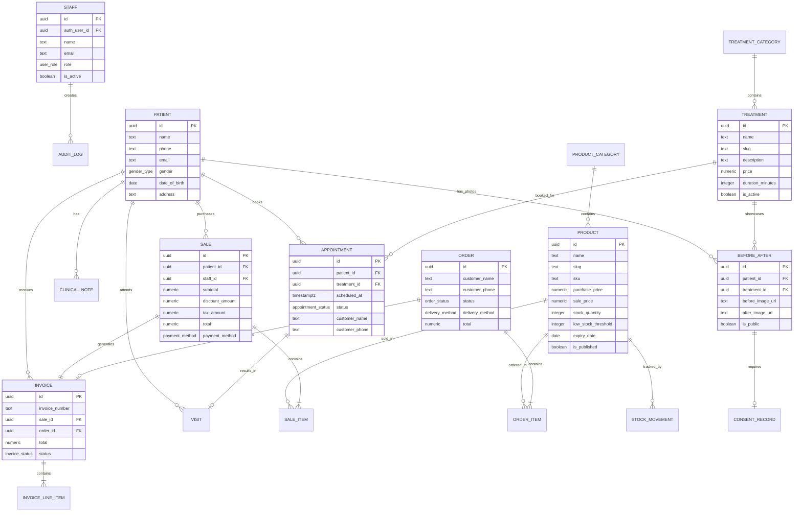

# 05 — Database Blueprint

## Brimish Skin Care Clinic — PostgreSQL Entity Model & Relationships

**Version:** 1.0.0-draft
**Date:** 2026-10-01

---

## 1. Design Principles

1. **Normalized to 3NF** — Eliminate data redundancy while maintaining practical query performance.
2. **Soft deletes** — All business entities use `deleted_at` timestamp instead of hard deletes.
3. **Audit fields** — Every table includes `created_at`, `updated_at`, `created_by`, `updated_by`.
4. **UUID primary keys** — Consistent with Supabase Auth and prevents enumeration attacks.
5. **Immutable financial records** — Invoices and their line items cannot be modified after creation; only voided.
6. **Timezone handling** — All timestamps stored as `TIMESTAMPTZ` (UTC). Application converts to Asia/Karachi for display.
7. **Currency** — All monetary fields use `NUMERIC(12, 2)` for PKR amounts (supports up to 9,999,999,999.99).
8. **Enums** — Defined as PostgreSQL ENUM types for type safety and constraint enforcement.

---

## 2. Enum Types

```sql
-- User roles
CREATE TYPE user_role AS ENUM ('super_admin', 'receptionist');

-- Appointment statuses
CREATE TYPE appointment_status AS ENUM (
  'pending', 'confirmed', 'rescheduled', 'checked_in',
  'completed', 'no_show', 'cancelled', 'expired'
);

-- Order statuses
CREATE TYPE order_status AS ENUM (
  'received', 'confirmed', 'preparing',
  'ready', 'shipped', 'delivered', 'picked_up',
  'completed', 'cancelled'
);

-- Order delivery methods
CREATE TYPE delivery_method AS ENUM ('pickup', 'delivery');

-- Payment methods
CREATE TYPE payment_method AS ENUM ('cash', 'card', 'bank_transfer');

-- Payment statuses
CREATE TYPE payment_status AS ENUM ('pending', 'paid', 'refunded', 'partially_refunded');

-- Invoice statuses
CREATE TYPE invoice_status AS ENUM ('issued', 'paid', 'voided');

-- Discount types
CREATE TYPE discount_type AS ENUM ('percentage', 'fixed');

-- Stock movement types
CREATE TYPE stock_movement_type AS ENUM (
  'initial', 'purchase', 'sale', 'adjustment',
  'return', 'reservation', 'reservation_release',
  'reservation_fulfillment', 'correction'
);

-- Review statuses
CREATE TYPE review_status AS ENUM ('pending', 'approved', 'rejected');

-- Gender options
CREATE TYPE gender_type AS ENUM ('male', 'female', 'other');

-- Consent statuses
CREATE TYPE consent_status AS ENUM ('pending', 'given', 'revoked');

-- Audit action types
CREATE TYPE audit_action AS ENUM (
  'create', 'update', 'delete', 'void',
  'login', 'logout', 'export', 'email_sent'
);
```

---

## 3. Entity Relationship Diagram



---

## 4. Complete Table Definitions

### 4.1 Staff & Authentication

```sql
CREATE TABLE staff (
    id              UUID PRIMARY KEY DEFAULT gen_random_uuid(),
    auth_user_id    UUID NOT NULL UNIQUE REFERENCES auth.users(id) ON DELETE RESTRICT,
    name            TEXT NOT NULL,
    email           TEXT NOT NULL UNIQUE,
    phone           TEXT,
    role            user_role NOT NULL DEFAULT 'receptionist',
    is_active       BOOLEAN NOT NULL DEFAULT true,
    created_at      TIMESTAMPTZ NOT NULL DEFAULT now(),
    updated_at      TIMESTAMPTZ NOT NULL DEFAULT now()
);

-- Helper function for RLS
CREATE OR REPLACE FUNCTION get_user_role()
RETURNS user_role AS $$
  SELECT role FROM staff
  WHERE auth_user_id = auth.uid() AND is_active = true
  LIMIT 1;
$$ LANGUAGE sql SECURITY DEFINER STABLE;

-- Helper function to check if user is super_admin
CREATE OR REPLACE FUNCTION is_super_admin()
RETURNS BOOLEAN AS $$
  SELECT EXISTS(
    SELECT 1 FROM staff
    WHERE auth_user_id = auth.uid()
    AND role = 'super_admin'
    AND is_active = true
  );
$$ LANGUAGE sql SECURITY DEFINER STABLE;
```

### 4.2 Patients

```sql
CREATE TABLE patients (
    id              UUID PRIMARY KEY DEFAULT gen_random_uuid(),
    name            TEXT NOT NULL,
    phone           TEXT NOT NULL UNIQUE,
    email           TEXT,
    gender          gender_type,
    date_of_birth   DATE,
    address         TEXT,
    notes           TEXT,                   -- General notes (visible to both roles)
    created_at      TIMESTAMPTZ NOT NULL DEFAULT now(),
    updated_at      TIMESTAMPTZ NOT NULL DEFAULT now(),
    created_by      UUID REFERENCES staff(id),
    updated_by      UUID REFERENCES staff(id),
    deleted_at      TIMESTAMPTZ            -- Soft delete
);

CREATE INDEX idx_patients_phone ON patients(phone) WHERE deleted_at IS NULL;
CREATE INDEX idx_patients_name ON patients(name) WHERE deleted_at IS NULL;
CREATE INDEX idx_patients_deleted ON patients(deleted_at);
```

### 4.3 Clinical Notes (Doctor-Only)

```sql
CREATE TABLE clinical_notes (
    id              UUID PRIMARY KEY DEFAULT gen_random_uuid(),
    patient_id      UUID NOT NULL REFERENCES patients(id) ON DELETE RESTRICT,
    visit_id        UUID REFERENCES visits(id),          -- Optional link to visit
    appointment_id  UUID REFERENCES appointments(id),    -- Optional link to appointment
    note_text       TEXT NOT NULL,
    diagnosis       TEXT,
    prescription    TEXT,
    created_at      TIMESTAMPTZ NOT NULL DEFAULT now(),
    updated_at      TIMESTAMPTZ NOT NULL DEFAULT now(),
    created_by      UUID NOT NULL REFERENCES staff(id),  -- Must be super_admin
    updated_by      UUID REFERENCES staff(id),
    deleted_at      TIMESTAMPTZ
);

CREATE INDEX idx_clinical_notes_patient ON clinical_notes(patient_id) WHERE deleted_at IS NULL;

-- RLS: Only super_admin can access
-- (policy defined in migrations)
```

### 4.4 Treatments

```sql
CREATE TABLE treatment_categories (
    id              UUID PRIMARY KEY DEFAULT gen_random_uuid(),
    name            TEXT NOT NULL UNIQUE,
    slug            TEXT NOT NULL UNIQUE,
    description     TEXT,
    sort_order      INTEGER NOT NULL DEFAULT 0,
    is_active       BOOLEAN NOT NULL DEFAULT true,
    created_at      TIMESTAMPTZ NOT NULL DEFAULT now(),
    updated_at      TIMESTAMPTZ NOT NULL DEFAULT now(),
    deleted_at      TIMESTAMPTZ
);

CREATE TABLE treatments (
    id              UUID PRIMARY KEY DEFAULT gen_random_uuid(),
    category_id     UUID REFERENCES treatment_categories(id),
    name            TEXT NOT NULL,
    slug            TEXT NOT NULL UNIQUE,
    description     TEXT,
    short_description TEXT,                 -- For listing cards
    price           NUMERIC(12, 2),         -- Nullable if "contact for pricing"
    price_label     TEXT,                   -- e.g., "Starting from", "Per session"
    duration_minutes INTEGER,
    image_url       TEXT,
    is_active       BOOLEAN NOT NULL DEFAULT true,
    is_featured     BOOLEAN NOT NULL DEFAULT false,
    sort_order      INTEGER NOT NULL DEFAULT 0,
    seo_title       TEXT,
    seo_description TEXT,
    created_at      TIMESTAMPTZ NOT NULL DEFAULT now(),
    updated_at      TIMESTAMPTZ NOT NULL DEFAULT now(),
    created_by      UUID REFERENCES staff(id),
    updated_by      UUID REFERENCES staff(id),
    deleted_at      TIMESTAMPTZ
);

CREATE INDEX idx_treatments_slug ON treatments(slug) WHERE deleted_at IS NULL;
CREATE INDEX idx_treatments_category ON treatments(category_id) WHERE deleted_at IS NULL;
CREATE INDEX idx_treatments_active ON treatments(is_active) WHERE deleted_at IS NULL;
```

### 4.5 Products & Inventory

```sql
CREATE TABLE product_categories (
    id              UUID PRIMARY KEY DEFAULT gen_random_uuid(),
    name            TEXT NOT NULL UNIQUE,
    slug            TEXT NOT NULL UNIQUE,
    description     TEXT,
    sort_order      INTEGER NOT NULL DEFAULT 0,
    is_active       BOOLEAN NOT NULL DEFAULT true,
    created_at      TIMESTAMPTZ NOT NULL DEFAULT now(),
    updated_at      TIMESTAMPTZ NOT NULL DEFAULT now(),
    deleted_at      TIMESTAMPTZ
);

CREATE TABLE products (
    id                  UUID PRIMARY KEY DEFAULT gen_random_uuid(),
    category_id         UUID REFERENCES product_categories(id),
    name                TEXT NOT NULL,
    slug                TEXT NOT NULL UNIQUE,
    sku                 TEXT NOT NULL UNIQUE,
    description         TEXT,
    short_description   TEXT,
    purchase_price      NUMERIC(12, 2) NOT NULL DEFAULT 0,   -- Cost price (admin only)
    sale_price          NUMERIC(12, 2) NOT NULL,
    stock_quantity      INTEGER NOT NULL DEFAULT 0,
    reserved_quantity   INTEGER NOT NULL DEFAULT 0,           -- Reserved by pending orders
    low_stock_threshold INTEGER NOT NULL DEFAULT 5,
    expiry_date         DATE,
    image_url           TEXT,
    is_published        BOOLEAN NOT NULL DEFAULT false,       -- Show on public website
    is_active           BOOLEAN NOT NULL DEFAULT true,        -- Active in system
    seo_title           TEXT,
    seo_description     TEXT,
    sort_order          INTEGER NOT NULL DEFAULT 0,
    created_at          TIMESTAMPTZ NOT NULL DEFAULT now(),
    updated_at          TIMESTAMPTZ NOT NULL DEFAULT now(),
    created_by          UUID REFERENCES staff(id),
    updated_by          UUID REFERENCES staff(id),
    deleted_at          TIMESTAMPTZ
);

-- Available stock = stock_quantity - reserved_quantity
-- Constraint: available stock must never be negative
ALTER TABLE products ADD CONSTRAINT chk_stock_non_negative
    CHECK (stock_quantity >= reserved_quantity AND stock_quantity >= 0 AND reserved_quantity >= 0);

CREATE INDEX idx_products_slug ON products(slug) WHERE deleted_at IS NULL;
CREATE INDEX idx_products_sku ON products(sku) WHERE deleted_at IS NULL;
CREATE INDEX idx_products_category ON products(category_id) WHERE deleted_at IS NULL;
CREATE INDEX idx_products_published ON products(is_published) WHERE deleted_at IS NULL AND is_active = true;
CREATE INDEX idx_products_low_stock ON products(stock_quantity, low_stock_threshold)
    WHERE deleted_at IS NULL AND is_active = true;

CREATE TABLE stock_movements (
    id              UUID PRIMARY KEY DEFAULT gen_random_uuid(),
    product_id      UUID NOT NULL REFERENCES products(id) ON DELETE RESTRICT,
    movement_type   stock_movement_type NOT NULL,
    quantity         INTEGER NOT NULL,       -- Positive for additions, negative for deductions
    quantity_before  INTEGER NOT NULL,       -- Stock before movement
    quantity_after   INTEGER NOT NULL,       -- Stock after movement
    reference_type   TEXT,                   -- 'sale', 'order', 'manual', etc.
    reference_id     UUID,                   -- ID of related sale/order/adjustment
    reason           TEXT,                   -- Required for manual adjustments
    created_at       TIMESTAMPTZ NOT NULL DEFAULT now(),
    created_by       UUID REFERENCES staff(id)
);

CREATE INDEX idx_stock_movements_product ON stock_movements(product_id);
CREATE INDEX idx_stock_movements_created ON stock_movements(created_at);
CREATE INDEX idx_stock_movements_reference ON stock_movements(reference_type, reference_id);
```

### 4.6 Appointments

```sql
CREATE TABLE appointments (
    id              UUID PRIMARY KEY DEFAULT gen_random_uuid(),
    patient_id      UUID REFERENCES patients(id),          -- NULL if not yet linked to patient
    treatment_id    UUID NOT NULL REFERENCES treatments(id),
    customer_name   TEXT NOT NULL,                          -- From booking form
    customer_phone  TEXT NOT NULL,                          -- From booking form
    customer_email  TEXT,                                   -- Optional
    scheduled_at    TIMESTAMPTZ NOT NULL,
    duration_minutes INTEGER,                               -- Copied from treatment at booking time
    status          appointment_status NOT NULL DEFAULT 'pending',
    message         TEXT,                                   -- Optional message from patient
    cancellation_reason TEXT,
    rescheduled_from UUID REFERENCES appointments(id),     -- If rescheduled, link to original
    reminder_sent   BOOLEAN NOT NULL DEFAULT false,
    confirmed_at    TIMESTAMPTZ,
    confirmed_by    UUID REFERENCES staff(id),
    created_at      TIMESTAMPTZ NOT NULL DEFAULT now(),
    updated_at      TIMESTAMPTZ NOT NULL DEFAULT now(),
    created_by      UUID REFERENCES staff(id),             -- NULL if created via public booking
    updated_by      UUID REFERENCES staff(id),
    deleted_at      TIMESTAMPTZ
);

CREATE INDEX idx_appointments_patient ON appointments(patient_id) WHERE deleted_at IS NULL;
CREATE INDEX idx_appointments_scheduled ON appointments(scheduled_at) WHERE deleted_at IS NULL;
CREATE INDEX idx_appointments_status ON appointments(status) WHERE deleted_at IS NULL;
CREATE INDEX idx_appointments_phone ON appointments(customer_phone) WHERE deleted_at IS NULL;
CREATE INDEX idx_appointments_reminder ON appointments(scheduled_at, reminder_sent, status)
    WHERE deleted_at IS NULL AND status = 'confirmed' AND reminder_sent = false;
```

### 4.7 Visits

```sql
CREATE TABLE visits (
    id              UUID PRIMARY KEY DEFAULT gen_random_uuid(),
    patient_id      UUID NOT NULL REFERENCES patients(id) ON DELETE RESTRICT,
    appointment_id  UUID REFERENCES appointments(id),
    treatment_id    UUID REFERENCES treatments(id),
    visit_date      TIMESTAMPTZ NOT NULL DEFAULT now(),
    notes           TEXT,                   -- General visit notes (visible to both roles)
    sale_id         UUID REFERENCES sales(id),  -- Linked POS sale if any
    created_at      TIMESTAMPTZ NOT NULL DEFAULT now(),
    updated_at      TIMESTAMPTZ NOT NULL DEFAULT now(),
    created_by      UUID REFERENCES staff(id),
    updated_by      UUID REFERENCES staff(id)
);

CREATE INDEX idx_visits_patient ON visits(patient_id);
CREATE INDEX idx_visits_date ON visits(visit_date);
CREATE INDEX idx_visits_appointment ON visits(appointment_id);
```

### 4.8 Sales (POS)

```sql
CREATE TABLE sales (
    id                  UUID PRIMARY KEY DEFAULT gen_random_uuid(),
    patient_id          UUID REFERENCES patients(id),       -- NULL for walk-in
    staff_id            UUID NOT NULL REFERENCES staff(id),
    customer_name       TEXT,                                -- For walk-in customers
    subtotal            NUMERIC(12, 2) NOT NULL,
    discount_type       discount_type,
    discount_value      NUMERIC(12, 2) DEFAULT 0,           -- % value or fixed amount
    discount_amount     NUMERIC(12, 2) NOT NULL DEFAULT 0,  -- Calculated discount in PKR
    tax_rate            NUMERIC(5, 2) DEFAULT 0,             -- Tax percentage
    tax_amount          NUMERIC(12, 2) NOT NULL DEFAULT 0,
    total               NUMERIC(12, 2) NOT NULL,
    payment_method      payment_method NOT NULL,
    payment_status      payment_status NOT NULL DEFAULT 'paid',
    amount_received     NUMERIC(12, 2),                     -- For cash: amount tendered
    change_amount       NUMERIC(12, 2),                     -- For cash: change given
    idempotency_key     TEXT UNIQUE,                        -- Prevent duplicate submissions
    voided_at           TIMESTAMPTZ,
    voided_by           UUID REFERENCES staff(id),
    void_reason         TEXT,
    created_at          TIMESTAMPTZ NOT NULL DEFAULT now(),
    updated_at          TIMESTAMPTZ NOT NULL DEFAULT now()
);

CREATE INDEX idx_sales_patient ON sales(patient_id);
CREATE INDEX idx_sales_staff ON sales(staff_id);
CREATE INDEX idx_sales_created ON sales(created_at);
CREATE INDEX idx_sales_idempotency ON sales(idempotency_key);

CREATE TABLE sale_items (
    id              UUID PRIMARY KEY DEFAULT gen_random_uuid(),
    sale_id         UUID NOT NULL REFERENCES sales(id) ON DELETE RESTRICT,
    product_id      UUID REFERENCES products(id),           -- NULL for services
    treatment_id    UUID REFERENCES treatments(id),         -- NULL for products
    item_type       TEXT NOT NULL CHECK (item_type IN ('product', 'service')),
    name            TEXT NOT NULL,                           -- Denormalized for immutability
    quantity        INTEGER NOT NULL DEFAULT 1,
    unit_price      NUMERIC(12, 2) NOT NULL,                -- Price at time of sale
    discount_type   discount_type,
    discount_value  NUMERIC(12, 2) DEFAULT 0,
    discount_amount NUMERIC(12, 2) NOT NULL DEFAULT 0,
    line_total      NUMERIC(12, 2) NOT NULL,                -- (unit_price * quantity) - discount
    created_at      TIMESTAMPTZ NOT NULL DEFAULT now()
);

CREATE INDEX idx_sale_items_sale ON sale_items(sale_id);
CREATE INDEX idx_sale_items_product ON sale_items(product_id);
```

### 4.9 Orders (Online)

```sql
CREATE TABLE orders (
    id                  UUID PRIMARY KEY DEFAULT gen_random_uuid(),
    order_number        TEXT NOT NULL UNIQUE,                -- Human-readable: BSC-ORD-XXXXX
    patient_id          UUID REFERENCES patients(id),       -- Linked if phone matches
    customer_name       TEXT NOT NULL,
    customer_phone      TEXT NOT NULL,
    customer_email      TEXT,
    delivery_method     delivery_method NOT NULL,
    delivery_address    TEXT,                                -- Required if delivery
    delivery_city       TEXT,
    delivery_notes      TEXT,
    status              order_status NOT NULL DEFAULT 'received',
    subtotal            NUMERIC(12, 2) NOT NULL,
    delivery_fee        NUMERIC(12, 2) NOT NULL DEFAULT 0,
    discount_amount     NUMERIC(12, 2) NOT NULL DEFAULT 0,
    tax_amount          NUMERIC(12, 2) NOT NULL DEFAULT 0,
    total               NUMERIC(12, 2) NOT NULL,
    payment_method      payment_method NOT NULL DEFAULT 'cash',  -- COD for MVP
    payment_status      payment_status NOT NULL DEFAULT 'pending',
    notes               TEXT,                                -- Internal staff notes
    cancelled_at        TIMESTAMPTZ,
    cancelled_by        UUID REFERENCES staff(id),
    cancellation_reason TEXT,
    fulfilled_at        TIMESTAMPTZ,
    completed_at        TIMESTAMPTZ,
    created_at          TIMESTAMPTZ NOT NULL DEFAULT now(),
    updated_at          TIMESTAMPTZ NOT NULL DEFAULT now(),
    deleted_at          TIMESTAMPTZ
);

CREATE INDEX idx_orders_status ON orders(status) WHERE deleted_at IS NULL;
CREATE INDEX idx_orders_phone ON orders(customer_phone) WHERE deleted_at IS NULL;
CREATE INDEX idx_orders_created ON orders(created_at) WHERE deleted_at IS NULL;
CREATE INDEX idx_orders_number ON orders(order_number);

CREATE TABLE order_items (
    id              UUID PRIMARY KEY DEFAULT gen_random_uuid(),
    order_id        UUID NOT NULL REFERENCES orders(id) ON DELETE RESTRICT,
    product_id      UUID NOT NULL REFERENCES products(id),
    name            TEXT NOT NULL,                           -- Denormalized
    quantity        INTEGER NOT NULL DEFAULT 1,
    unit_price      NUMERIC(12, 2) NOT NULL,                -- Price at time of order
    line_total      NUMERIC(12, 2) NOT NULL,
    created_at      TIMESTAMPTZ NOT NULL DEFAULT now()
);

CREATE INDEX idx_order_items_order ON order_items(order_id);
CREATE INDEX idx_order_items_product ON order_items(product_id);
```

### 4.10 Invoices

```sql
CREATE TABLE invoices (
    id                  UUID PRIMARY KEY DEFAULT gen_random_uuid(),
    invoice_number      TEXT NOT NULL UNIQUE,                 -- BSC-INV-2026-00001
    sale_id             UUID UNIQUE REFERENCES sales(id),     -- From POS sale
    order_id            UUID UNIQUE REFERENCES orders(id),    -- From online order
    patient_id          UUID REFERENCES patients(id),
    customer_name       TEXT NOT NULL,
    customer_phone      TEXT,
    customer_email      TEXT,
    customer_address    TEXT,

    -- Clinic identity (denormalized at invoice creation for immutability)
    clinic_name         TEXT NOT NULL,
    clinic_address      TEXT NOT NULL,
    clinic_phone        TEXT NOT NULL,
    clinic_email        TEXT,
    clinic_ntn          TEXT,                                  -- National Tax Number
    clinic_strn         TEXT,                                  -- Sales Tax Registration Number

    subtotal            NUMERIC(12, 2) NOT NULL,
    discount_amount     NUMERIC(12, 2) NOT NULL DEFAULT 0,
    tax_label           TEXT DEFAULT 'GST',                    -- Configurable tax label
    tax_rate            NUMERIC(5, 2) DEFAULT 0,
    tax_amount          NUMERIC(12, 2) NOT NULL DEFAULT 0,
    total               NUMERIC(12, 2) NOT NULL,
    payment_method      payment_method,
    payment_status      payment_status NOT NULL DEFAULT 'pending',
    status              invoice_status NOT NULL DEFAULT 'issued',
    paid_at             TIMESTAMPTZ,

    -- Void handling
    voided_at           TIMESTAMPTZ,
    voided_by           UUID REFERENCES staff(id),
    void_reason         TEXT,
    credit_note_id      UUID REFERENCES invoices(id),         -- Reference to credit note

    issued_at           TIMESTAMPTZ NOT NULL DEFAULT now(),
    created_at          TIMESTAMPTZ NOT NULL DEFAULT now(),
    created_by          UUID REFERENCES staff(id),

    -- Immutability: no updated_at — invoices are never modified
    -- Constraint: must be linked to either a sale or an order
    CONSTRAINT chk_invoice_source CHECK (
        (sale_id IS NOT NULL AND order_id IS NULL) OR
        (sale_id IS NULL AND order_id IS NOT NULL)
    )
);

CREATE INDEX idx_invoices_number ON invoices(invoice_number);
CREATE INDEX idx_invoices_sale ON invoices(sale_id);
CREATE INDEX idx_invoices_order ON invoices(order_id);
CREATE INDEX idx_invoices_patient ON invoices(patient_id);
CREATE INDEX idx_invoices_created ON invoices(created_at);
CREATE INDEX idx_invoices_status ON invoices(status);

CREATE TABLE invoice_line_items (
    id              UUID PRIMARY KEY DEFAULT gen_random_uuid(),
    invoice_id      UUID NOT NULL REFERENCES invoices(id) ON DELETE RESTRICT,
    description     TEXT NOT NULL,                            -- Item name/description
    quantity        INTEGER NOT NULL DEFAULT 1,
    unit_price      NUMERIC(12, 2) NOT NULL,
    discount_amount NUMERIC(12, 2) NOT NULL DEFAULT 0,
    line_total      NUMERIC(12, 2) NOT NULL,
    sort_order      INTEGER NOT NULL DEFAULT 0,
    created_at      TIMESTAMPTZ NOT NULL DEFAULT now()
    -- No updated_at — immutable
);

CREATE INDEX idx_invoice_line_items_invoice ON invoice_line_items(invoice_id);
```

### 4.11 Invoice Number Sequence

```sql
-- Atomic, gap-free invoice numbering
CREATE TABLE invoice_sequences (
    year            INTEGER NOT NULL,
    last_number     INTEGER NOT NULL DEFAULT 0,
    PRIMARY KEY (year)
);

-- Function to generate next invoice number
CREATE OR REPLACE FUNCTION generate_invoice_number()
RETURNS TEXT AS $$
DECLARE
    current_year INTEGER;
    next_num INTEGER;
BEGIN
    current_year := EXTRACT(YEAR FROM now() AT TIME ZONE 'Asia/Karachi');

    INSERT INTO invoice_sequences (year, last_number)
    VALUES (current_year, 1)
    ON CONFLICT (year) DO UPDATE
    SET last_number = invoice_sequences.last_number + 1
    RETURNING last_number INTO next_num;

    RETURN 'BSC-' || current_year || '-' || LPAD(next_num::TEXT, 5, '0');
END;
$$ LANGUAGE plpgsql;
```

### 4.12 Before/After Gallery

```sql
CREATE TABLE before_after (
    id                  UUID PRIMARY KEY DEFAULT gen_random_uuid(),
    patient_id          UUID REFERENCES patients(id),
    treatment_id        UUID REFERENCES treatments(id),
    visit_id            UUID REFERENCES visits(id),
    title               TEXT,
    description         TEXT,
    before_image_url    TEXT NOT NULL,                    -- Supabase Storage path
    after_image_url     TEXT NOT NULL,                    -- Supabase Storage path
    is_public           BOOLEAN NOT NULL DEFAULT false,
    sort_order          INTEGER NOT NULL DEFAULT 0,
    created_at          TIMESTAMPTZ NOT NULL DEFAULT now(),
    updated_at          TIMESTAMPTZ NOT NULL DEFAULT now(),
    created_by          UUID REFERENCES staff(id),
    updated_by          UUID REFERENCES staff(id),
    deleted_at          TIMESTAMPTZ
);

CREATE INDEX idx_before_after_patient ON before_after(patient_id) WHERE deleted_at IS NULL;
CREATE INDEX idx_before_after_treatment ON before_after(treatment_id) WHERE deleted_at IS NULL;
CREATE INDEX idx_before_after_public ON before_after(is_public) WHERE deleted_at IS NULL;

CREATE TABLE consent_records (
    id                  UUID PRIMARY KEY DEFAULT gen_random_uuid(),
    before_after_id     UUID NOT NULL REFERENCES before_after(id) ON DELETE RESTRICT,
    patient_id          UUID NOT NULL REFERENCES patients(id),
    consent_status      consent_status NOT NULL DEFAULT 'pending',
    consent_given_at    TIMESTAMPTZ,
    consent_revoked_at  TIMESTAMPTZ,
    consent_notes       TEXT,                             -- How consent was obtained
    recorded_by         UUID NOT NULL REFERENCES staff(id),
    created_at          TIMESTAMPTZ NOT NULL DEFAULT now(),
    updated_at          TIMESTAMPTZ NOT NULL DEFAULT now()
);

CREATE INDEX idx_consent_records_before_after ON consent_records(before_after_id);
CREATE INDEX idx_consent_records_patient ON consent_records(patient_id);
```

### 4.13 Reviews

```sql
CREATE TABLE reviews (
    id                  UUID PRIMARY KEY DEFAULT gen_random_uuid(),
    reviewer_name       TEXT NOT NULL,
    rating              INTEGER NOT NULL CHECK (rating >= 1 AND rating <= 5),
    review_text         TEXT NOT NULL,
    treatment_id        UUID REFERENCES treatments(id),      -- Optional treatment reference
    status              review_status NOT NULL DEFAULT 'pending',
    moderated_at        TIMESTAMPTZ,
    moderated_by        UUID REFERENCES staff(id),
    rejection_reason    TEXT,
    ip_address          INET,                                -- For rate limiting
    created_at          TIMESTAMPTZ NOT NULL DEFAULT now(),
    deleted_at          TIMESTAMPTZ
);

CREATE INDEX idx_reviews_status ON reviews(status) WHERE deleted_at IS NULL;
CREATE INDEX idx_reviews_created ON reviews(created_at) WHERE deleted_at IS NULL;
CREATE INDEX idx_reviews_ip ON reviews(ip_address, created_at);
```

### 4.14 Clinic Settings

```sql
CREATE TABLE clinic_settings (
    id                  UUID PRIMARY KEY DEFAULT gen_random_uuid(),
    clinic_name         TEXT NOT NULL DEFAULT 'Brimish Skin Care',
    clinic_address      TEXT,
    clinic_city         TEXT DEFAULT 'Peshawar',
    clinic_phone        TEXT,
    clinic_email        TEXT,
    clinic_website      TEXT,
    ntn                 TEXT,                                 -- National Tax Number
    strn                TEXT,                                 -- Sales Tax Registration Number
    default_tax_rate    NUMERIC(5, 2) DEFAULT 0,
    default_tax_label   TEXT DEFAULT 'GST',
    currency_code       TEXT NOT NULL DEFAULT 'PKR',
    timezone            TEXT NOT NULL DEFAULT 'Asia/Karachi',
    google_maps_embed   TEXT,
    social_facebook     TEXT,
    social_instagram    TEXT,
    social_whatsapp     TEXT,
    logo_url            TEXT,
    updated_at          TIMESTAMPTZ NOT NULL DEFAULT now(),
    updated_by          UUID REFERENCES staff(id)
);

CREATE TABLE operating_hours (
    id                  UUID PRIMARY KEY DEFAULT gen_random_uuid(),
    day_of_week         INTEGER NOT NULL CHECK (day_of_week >= 0 AND day_of_week <= 6),  -- 0=Sunday
    open_time           TIME,
    close_time          TIME,
    is_closed           BOOLEAN NOT NULL DEFAULT false,
    created_at          TIMESTAMPTZ NOT NULL DEFAULT now(),
    updated_at          TIMESTAMPTZ NOT NULL DEFAULT now(),
    UNIQUE (day_of_week)
);
```

### 4.15 Audit Log

```sql
CREATE TABLE audit_log (
    id              UUID PRIMARY KEY DEFAULT gen_random_uuid(),
    staff_id        UUID REFERENCES staff(id),
    action          audit_action NOT NULL,
    entity_type     TEXT NOT NULL,                           -- 'patient', 'sale', 'invoice', etc.
    entity_id       UUID,
    description     TEXT,
    old_values      JSONB,                                   -- Previous state (for updates)
    new_values      JSONB,                                   -- New state
    ip_address      INET,
    created_at      TIMESTAMPTZ NOT NULL DEFAULT now()
);

-- Audit log is append-only, no updates or deletes
-- No soft delete — audit records are permanent

CREATE INDEX idx_audit_log_staff ON audit_log(staff_id);
CREATE INDEX idx_audit_log_entity ON audit_log(entity_type, entity_id);
CREATE INDEX idx_audit_log_created ON audit_log(created_at);
CREATE INDEX idx_audit_log_action ON audit_log(action);
```

### 4.16 Email Log

```sql
CREATE TABLE email_log (
    id              UUID PRIMARY KEY DEFAULT gen_random_uuid(),
    template_name   TEXT NOT NULL,
    recipient_email TEXT NOT NULL,
    subject         TEXT NOT NULL,
    status          TEXT NOT NULL CHECK (status IN ('sent', 'failed', 'pending')),
    resend_id       TEXT,                                    -- Resend API message ID
    error_message   TEXT,
    reference_type  TEXT,                                    -- 'appointment', 'order', 'invoice'
    reference_id    UUID,
    retry_count     INTEGER NOT NULL DEFAULT 0,
    created_at      TIMESTAMPTZ NOT NULL DEFAULT now()
);

CREATE INDEX idx_email_log_status ON email_log(status);
CREATE INDEX idx_email_log_reference ON email_log(reference_type, reference_id);
CREATE INDEX idx_email_log_created ON email_log(created_at);
```

### 4.17 Contact Form Submissions

```sql
CREATE TABLE contact_submissions (
    id              UUID PRIMARY KEY DEFAULT gen_random_uuid(),
    name            TEXT NOT NULL,
    email           TEXT,
    phone           TEXT,
    subject         TEXT,
    message         TEXT NOT NULL,
    is_read         BOOLEAN NOT NULL DEFAULT false,
    ip_address      INET,
    created_at      TIMESTAMPTZ NOT NULL DEFAULT now()
);

CREATE INDEX idx_contact_submissions_read ON contact_submissions(is_read);
CREATE INDEX idx_contact_submissions_created ON contact_submissions(created_at);
```

### 4.18 Order Number Sequence

```sql
-- Similar to invoice numbering
CREATE TABLE order_sequences (
    year            INTEGER NOT NULL,
    last_number     INTEGER NOT NULL DEFAULT 0,
    PRIMARY KEY (year)
);

CREATE OR REPLACE FUNCTION generate_order_number()
RETURNS TEXT AS $$
DECLARE
    current_year INTEGER;
    next_num INTEGER;
BEGIN
    current_year := EXTRACT(YEAR FROM now() AT TIME ZONE 'Asia/Karachi');

    INSERT INTO order_sequences (year, last_number)
    VALUES (current_year, 1)
    ON CONFLICT (year) DO UPDATE
    SET last_number = order_sequences.last_number + 1
    RETURNING last_number INTO next_num;

    RETURN 'BSC-ORD-' || current_year || '-' || LPAD(next_num::TEXT, 5, '0');
END;
$$ LANGUAGE plpgsql;
```

---

## 5. Relationship Summary

| Parent | Child | Type | FK Column | On Delete |
|--------|-------|------|-----------|-----------|
| `auth.users` | `staff` | 1:1 | `auth_user_id` | RESTRICT |
| `patients` | `appointments` | 1:N | `patient_id` | SET NULL |
| `patients` | `clinical_notes` | 1:N | `patient_id` | RESTRICT |
| `patients` | `visits` | 1:N | `patient_id` | RESTRICT |
| `patients` | `sales` | 1:N | `patient_id` | SET NULL |
| `patients` | `invoices` | 1:N | `patient_id` | SET NULL |
| `patients` | `before_after` | 1:N | `patient_id` | SET NULL |
| `treatment_categories` | `treatments` | 1:N | `category_id` | SET NULL |
| `treatments` | `appointments` | 1:N | `treatment_id` | RESTRICT |
| `treatments` | `before_after` | 1:N | `treatment_id` | SET NULL |
| `product_categories` | `products` | 1:N | `category_id` | SET NULL |
| `products` | `sale_items` | 1:N | `product_id` | RESTRICT |
| `products` | `order_items` | 1:N | `product_id` | RESTRICT |
| `products` | `stock_movements` | 1:N | `product_id` | RESTRICT |
| `sales` | `sale_items` | 1:N | `sale_id` | RESTRICT |
| `sales` | `invoices` | 1:1 | `sale_id` | RESTRICT |
| `orders` | `order_items` | 1:N | `order_id` | RESTRICT |
| `orders` | `invoices` | 1:1 | `order_id` | RESTRICT |
| `invoices` | `invoice_line_items` | 1:N | `invoice_id` | RESTRICT |
| `before_after` | `consent_records` | 1:N | `before_after_id` | RESTRICT |
| `staff` | `audit_log` | 1:N | `staff_id` | SET NULL |

---

## 6. Migration Strategy

Migrations will be managed via Supabase CLI (`supabase/migrations/`):

1. **001_enums.sql** — All ENUM type definitions
2. **002_staff.sql** — Staff table + helper functions
3. **003_clinic_settings.sql** — Settings + operating hours
4. **004_patients.sql** — Patients + clinical notes
5. **005_treatments.sql** — Categories + treatments
6. **006_products.sql** — Categories + products + stock movements
7. **007_appointments.sql** — Appointments table
8. **008_visits.sql** — Visits table
9. **009_sales.sql** — Sales + sale items
10. **010_orders.sql** — Orders + order items + sequences
11. **011_invoices.sql** — Invoices + line items + sequences
12. **012_gallery.sql** — Before/after + consent records
13. **013_reviews.sql** — Reviews
14. **014_contact.sql** — Contact submissions
15. **015_audit.sql** — Audit log + email log
16. **016_rls_policies.sql** — All RLS policies
17. **017_indexes.sql** — Additional performance indexes
18. **018_seed.sql** — Initial seed data (clinic settings, admin user, operating hours)
