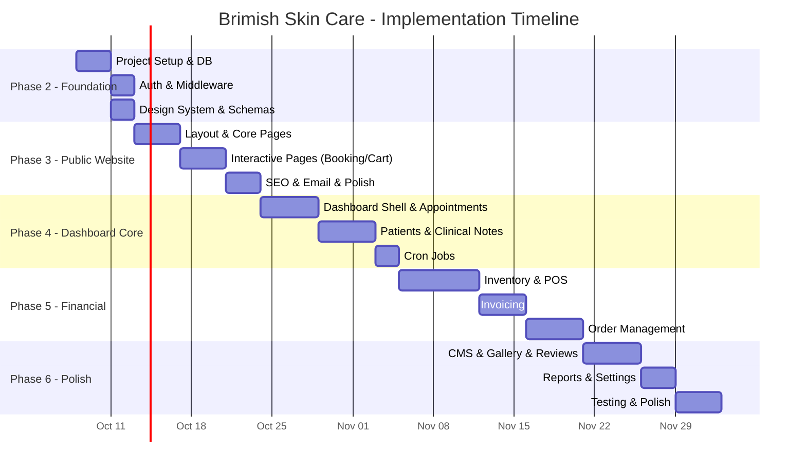

# 08 — Implementation Roadmap

## Brimish Skin Care Clinic — MVP Scope, Implementation Sequence & Acceptance Criteria

**Version:** 1.0.0-draft
**Date:** 2026-10-01

---

## 1. MVP vs. Post-MVP Scope

### 1.1 MVP Scope (Phase 2–6)

| Module | In MVP | Notes |
|--------|--------|-------|
| Public Website (Home, About, Treatments, Products, Gallery, Reviews, Contact) | ✅ | All pages |
| Appointment Booking | ✅ | Full flow |
| Product Ordering (Guest Checkout) | ✅ | COD only |
| Patient Management | ✅ | Full CRUD + history |
| Clinical Notes | ✅ | Doctor-only access |
| POS | ✅ | Single payment method per sale |
| Invoicing | ✅ | Thermal + A4 + PDF + Email |
| Inventory | ✅ | Full stock management |
| Order Management | ✅ | Full lifecycle |
| Reviews (moderation) | ✅ | Submit + moderate |
| Before/After Gallery | ✅ | Upload + consent + slider |
| Basic Reporting | ✅ | Revenue summary, appointment stats |
| Settings (Clinic info, hours, tax, staff) | ✅ | Core settings |
| Email Notifications | ✅ | All transactional emails |
| Audit Logging | ✅ | Core operations |
| CSV Export | ✅ | All applicable modules |
| Auth (Login, Roles) | ✅ | Email/password, 2 roles |
| SEO (Meta, Structured Data, Sitemap) | ✅ | All public pages |

### 1.2 Post-MVP Enhancements

| Feature | Priority | Estimated Effort |
|---------|----------|-----------------|
| WhatsApp notifications (via WhatsApp Business API or wa.me links) | High | Medium |
| SMS notifications (e.g., Twilio, local provider) | High | Medium |
| Online payment gateway (JazzCash, EasyPaisa, card) | High | Large |
| Urdu language support | Medium | Large |
| Advanced reporting dashboard (charts, trends, comparisons) | Medium | Medium |
| Patient portal (view own history, book appointments) | Medium | Large |
| Multi-Factor Authentication (MFA) for staff | Medium | Small |
| Product variants (sizes, quantities) | Medium | Medium |
| Split/partial payments | Medium | Small |
| Loyalty/rewards program | Low | Medium |
| Patient record merging | Low | Medium |
| SMS/WhatsApp appointment reminders | High | Medium |
| Google Analytics integration | Low | Small |
| Automated review request after visit | Low | Small |
| Inventory purchase orders | Low | Medium |
| Customer accounts (login for returning customers) | Low | Large |
| Multi-clinic support | Low | Large |
| Dark mode for dashboard | Low | Small |
| Progressive Web App (PWA) for dashboard | Low | Medium |
| FBR POS integration (if/when required) | Conditional | Large |

---

## 2. Implementation Phases

### Phase 2: Foundation & Infrastructure

**Duration:** ~1 week
**Goal:** Project scaffolding, database, auth, and design system

| Task | Description | Dependencies |
|------|-------------|-------------|
| 2.1 | Initialize Next.js project with TypeScript, Tailwind CSS | None |
| 2.2 | Install and configure shadcn/ui | 2.1 |
| 2.3 | Set up Supabase project (local + cloud) | None |
| 2.4 | Create database migrations (all tables, enums, functions, indexes) | 2.3 |
| 2.5 | Configure Supabase Auth (email/password) | 2.3 |
| 2.6 | Implement RLS policies for all tables | 2.4 |
| 2.7 | Set up Supabase Storage buckets (public + private) | 2.3 |
| 2.8 | Create Supabase client utilities (browser, server, admin) | 2.1, 2.3 |
| 2.9 | Implement Next.js middleware for auth + role checking | 2.5, 2.8 |
| 2.10 | Define Zod validation schemas for all entities | 2.1 |
| 2.11 | Set up Resend email service + base template | None |
| 2.12 | Create design system (colors, typography, spacing, components) | 2.2 |
| 2.13 | Create seed data (admin user, clinic settings, sample data) | 2.4 |
| 2.14 | Set up Vercel project + environment variables | 2.1 |
| 2.15 | Set up Vitest for unit testing | 2.1 |

**Acceptance Criteria:**
- [ ] Next.js app runs locally with no errors
- [ ] Supabase local instance running with all tables created
- [ ] Admin user can log in and access dashboard shell
- [ ] Non-authenticated users redirected to login
- [ ] RLS policies tested with different role contexts
- [ ] Zod schemas validate sample data correctly
- [ ] Resend sends test email successfully
- [ ] Design system components render correctly
- [ ] Vercel preview deployment works

---

### Phase 3: Public Website

**Duration:** ~1.5 weeks
**Goal:** Complete public-facing website with all pages

| Task | Description | Dependencies |
|------|-------------|-------------|
| 3.1 | Public layout (header, footer, navigation) | 2.12 |
| 3.2 | Home page (hero, featured treatments, CTAs, testimonials) | 3.1 |
| 3.3 | About page (doctor profile, clinic story) | 3.1 |
| 3.4 | Treatments listing page (categories, cards) | 3.1 |
| 3.5 | Treatment detail page (description, pricing, CTA) | 3.4 |
| 3.6 | Products listing page (categories, cards, cart indicator) | 3.1 |
| 3.7 | Product detail page (images, description, add-to-cart) | 3.6 |
| 3.8 | Client-side cart (state management, localStorage) | 3.6 |
| 3.9 | Gallery page (before/after slider, categories) | 3.1 |
| 3.10 | Reviews page (approved reviews, submission form) | 3.1 |
| 3.11 | Contact page (info, map, contact form) | 3.1 |
| 3.12 | Appointment booking page (form, validation, submission) | 3.1, 2.10 |
| 3.13 | Cart page (/order/cart) | 3.8 |
| 3.14 | Checkout page (/order/checkout — guest checkout form) | 3.13 |
| 3.15 | Order confirmation page | 3.14 |
| 3.16 | Privacy Policy and Terms of Service pages | 3.1 |
| 3.17 | SEO: meta tags, structured data, sitemap.xml, robots.txt | 3.2–3.16 |
| 3.18 | Booking/order/review/contact server actions with rate limiting | 3.12–3.15 |
| 3.19 | Email: booking received, order confirmation, contact received | 3.18, 2.11 |
| 3.20 | Mobile responsiveness testing and polish | 3.2–3.16 |

**Acceptance Criteria:**
- [ ] All public pages render correctly on mobile (375px), tablet (768px), desktop (1280px)
- [ ] Appointment booking submits successfully and appears in database
- [ ] Duplicate booking prevention works (same phone + same day)
- [ ] Product ordering: add to cart → checkout → order created → stock reserved
- [ ] Order rejects if insufficient stock
- [ ] Review submission with honeypot and rate limiting works
- [ ] Contact form submission works
- [ ] SEO: Lighthouse SEO score > 90
- [ ] Performance: Lighthouse Performance score > 90
- [ ] Email notifications sent for booking, order, contact
- [ ] Cart persists across page refreshes (localStorage)
- [ ] Before/after slider works with touch and mouse
- [ ] No console errors in production build

---

### Phase 4: Dashboard Core

**Duration:** ~2 weeks
**Goal:** Dashboard shell, appointments, patients, clinical notes

| Task | Description | Dependencies |
|------|-------------|-------------|
| 4.1 | Dashboard layout (sidebar, top bar, responsive) | 2.12 |
| 4.2 | Dashboard home (overview stats, quick actions) | 4.1 |
| 4.3 | Appointments list (filterable, paginated) | 4.1 |
| 4.4 | Appointment detail/edit | 4.3 |
| 4.5 | Appointment calendar view (day/week) | 4.3 |
| 4.6 | Appointment status management (confirm, reschedule, cancel, complete, no-show) | 4.4 |
| 4.7 | Appointment confirmation/reschedule emails | 4.6, 2.11 |
| 4.8 | Patient list (searchable, paginated) | 4.1 |
| 4.9 | Patient registration form | 4.8 |
| 4.10 | Patient profile page (tabbed: overview, visits, treatments, purchases, invoices, photos) | 4.8 |
| 4.11 | Clinical notes tab (doctor only — RLS + UI restriction) | 4.10 |
| 4.12 | Clinical notes CRUD (create, edit, view — doctor only) | 4.11 |
| 4.13 | Visit history (auto-generated from completed appointments/sales) | 4.10 |
| 4.14 | Follow-up appointment creation from patient profile | 4.10, 4.3 |
| 4.15 | Auto-link appointments to patients by phone number | 4.6, 4.8 |
| 4.16 | Appointment reminder cron job | 4.6 |
| 4.17 | Stale appointment cleanup cron job | 4.6 |

**Acceptance Criteria:**
- [ ] Dashboard loads with correct stats for logged-in user's role
- [ ] Receptionist sees operational stats; doctor sees financial stats too
- [ ] Appointment CRUD works fully (create, view, edit, confirm, reschedule, cancel, complete, no-show)
- [ ] Calendar view shows appointments correctly
- [ ] Patient CRUD works (create, edit, view, search by name/phone)
- [ ] Patient profile shows all tabs with correct data
- [ ] Clinical notes visible only to Super Admin (test with receptionist account)
- [ ] Clinical notes CRUD works for doctor
- [ ] Visit history auto-updates when appointment marked complete
- [ ] Follow-up appointment links to patient
- [ ] Appointment confirmation email sent to patient
- [ ] Reminder cron sends emails for appointments in next 24h
- [ ] Stale appointments (pending > 48h) marked as expired
- [ ] Phone-based patient auto-linking works for new bookings

---

### Phase 5: Financial Operations

**Duration:** ~2.5 weeks
**Goal:** POS, Invoicing, Inventory, Order Management

| Task | Description | Dependencies |
|------|-------------|-------------|
| 5.1 | Inventory product CRUD (create, edit, soft-delete) | 4.1 |
| 5.2 | Product categories CRUD | 5.1 |
| 5.3 | Stock adjustment form with reason | 5.1 |
| 5.4 | Stock movement history view | 5.1 |
| 5.5 | Low-stock indicators and filter | 5.1 |
| 5.6 | POS terminal UI (full-screen, optimized) | 4.1 |
| 5.7 | POS: Customer selection (search + walk-in) | 5.6, 4.8 |
| 5.8 | POS: Product/service search and cart building | 5.6, 5.1 |
| 5.9 | POS: Discount application (per-item + cart-level) | 5.8 |
| 5.10 | POS: Payment processing (cash with change calc, card, bank transfer) | 5.9 |
| 5.11 | POS: Sale completion transaction (atomic: sale + stock deduction + invoice) | 5.10 |
| 5.12 | POS: Idempotency protection | 5.11 |
| 5.13 | POS: Visit record creation for treatment sales | 5.11 |
| 5.14 | Invoice list (searchable, filterable, paginated) | 4.1 |
| 5.15 | Invoice detail view (A4 layout) | 5.14 |
| 5.16 | Invoice thermal receipt layout (58mm + 80mm) | 5.14 |
| 5.17 | Invoice PDF generation | 5.15 |
| 5.18 | Invoice email delivery | 5.17, 2.11 |
| 5.19 | Invoice void (admin only, credit note) | 5.14 |
| 5.20 | Sale void (admin only) | 5.11 |
| 5.21 | Order management dashboard (list, filter, paginate) | 4.1 |
| 5.22 | Order detail view (customer info, items, status timeline) | 5.21 |
| 5.23 | Order status management (state machine transitions) | 5.22 |
| 5.24 | Order fulfillment (stock deduction + invoice generation) | 5.23, 5.11 |
| 5.25 | Order cancellation (stock release) | 5.23 |
| 5.26 | Order status email notifications | 5.23, 2.11 |
| 5.27 | Low-stock alert cron job | 5.1, 2.11 |
| 5.28 | Sales history view | 5.11 |
| 5.29 | Patient purchase history (in patient profile) | 5.11, 4.10 |
| 5.30 | Patient invoice history (in patient profile) | 5.14, 4.10 |

**Acceptance Criteria:**
- [ ] Product CRUD works with all fields including images
- [ ] Stock adjustments create movement records with reason
- [ ] Stock movement history shows complete audit trail
- [ ] POS: full sale flow works end-to-end (customer → items → discount → payment → receipt)
- [ ] POS: stock deducted atomically on sale completion
- [ ] POS: sale fails gracefully if stock insufficient (no partial deduction)
- [ ] POS: duplicate submission prevented by idempotency key
- [ ] POS: cash payment shows change calculation
- [ ] POS: treatment sale creates visit record
- [ ] Invoice: unique sequential numbering (BSC-YYYY-XXXXX)
- [ ] Invoice: renders correctly in A4 and thermal layouts
- [ ] Invoice: PDF downloads correctly
- [ ] Invoice: email delivery works
- [ ] Invoice: void creates credit note (admin only)
- [ ] Invoice: receptionist cannot void invoices
- [ ] Order: status transitions follow state machine rules
- [ ] Order: stock reserved on placement, deducted on fulfillment, released on cancellation
- [ ] Order: invoice auto-generated at fulfillment
- [ ] Order: customer receives email on status changes
- [ ] Low-stock cron sends email to admin for products below threshold
- [ ] Patient profile shows purchase and invoice history

---

### Phase 6: Content, Gallery, Reviews & Polish

**Duration:** ~1.5 weeks
**Goal:** CMS, Before/After, Reviews, Reporting, Settings, Final Polish

| Task | Description | Dependencies |
|------|-------------|-------------|
| 6.1 | Treatment CMS (CRUD from dashboard, slug generation, images) | 4.1 |
| 6.2 | Product CMS (content management, publish toggle) | 5.1 |
| 6.3 | Before/After upload (paired images, patient link, treatment link) | 4.10 |
| 6.4 | Consent recording (doctor only) | 6.3 |
| 6.5 | Public/private toggle (doctor only, requires consent) | 6.4 |
| 6.6 | Before/After gallery management (dashboard grid view) | 6.3 |
| 6.7 | Review moderation (pending queue, approve/reject) | 4.1 |
| 6.8 | Review management (list of all reviews by status) | 6.7 |
| 6.9 | Basic reporting: Revenue summary (daily/weekly/monthly) | 5.11 |
| 6.10 | Basic reporting: Appointment statistics | 4.3 |
| 6.11 | Basic reporting: Top treatments | 4.13 |
| 6.12 | Settings: Clinic information CRUD | 4.1 |
| 6.13 | Settings: Operating hours management | 6.12 |
| 6.14 | Settings: Tax configuration | 6.12 |
| 6.15 | Settings: Staff management (add/edit/deactivate) | 6.12 |
| 6.16 | Settings: My profile (password change) | 4.1 |
| 6.17 | Audit log viewer (admin — read-only list) | 4.1 |
| 6.18 | CSV export for all applicable modules | 5.1–5.30 |
| 6.19 | ISR cache revalidation on CMS content updates | 6.1–6.8 |
| 6.20 | Contact form submissions viewer | 4.1 |
| 6.21 | Notification indicators (new bookings, orders, low stock) | 4.2 |
| 6.22 | Final mobile responsiveness pass | All |
| 6.23 | Final accessibility audit (axe-core + manual) | All |
| 6.24 | Final performance audit (Lighthouse) | All |
| 6.25 | Error boundary and 404 page polish | All |

**Acceptance Criteria:**
- [ ] Treatment/product CMS: create, edit, delete works; public site updates via ISR
- [ ] Before/After: upload, consent, publish/unpublish flow works end-to-end
- [ ] Before/After: private images not accessible without signed URL
- [ ] Before/After: public gallery only shows consent-verified, published images
- [ ] Reviews: submit → moderate → approve → visible on public site
- [ ] Reviews: rate limiting prevents spam (1 per IP per 24h)
- [ ] Reports: revenue, appointment, and treatment reports render correctly
- [ ] Settings: clinic info saved and reflected on invoices and public site
- [ ] Settings: staff CRUD works; deactivated staff cannot log in
- [ ] CSV export downloads for all modules with correct data
- [ ] Audit log shows recent operations
- [ ] Notification badges show correct counts
- [ ] All pages accessible via keyboard
- [ ] Lighthouse: Performance > 90, Accessibility > 90, SEO > 90, Best Practices > 90
- [ ] No console errors in production build
- [ ] All E2E tests pass

---

## 3. Acceptance Criteria by Module

### 3.1 Appointment Booking (Public)

| # | Criterion | Verification |
|---|-----------|-------------|
| AC-01 | Booking form validates all required fields (name, phone, treatment, date/time) | Manual + E2E test |
| AC-02 | Phone validates Pakistani format (03XX-XXXXXXX) | Unit test + E2E |
| AC-03 | Booking creates appointment record with status 'pending' | DB verification |
| AC-04 | Duplicate booking (same phone + same date) is prevented | E2E test |
| AC-05 | Clinic receives email notification for new booking | Email log verification |
| AC-06 | Patient sees confirmation page with reference number | E2E test |
| AC-07 | Rate limiting: max 10 bookings per IP per hour | Integration test |

### 3.2 POS

| # | Criterion | Verification |
|---|-----------|-------------|
| AC-08 | Sale completes atomically (all or nothing) | Integration test |
| AC-09 | Stock deducted exactly once per sale | Integration test (verify movement log) |
| AC-10 | Sale fails if any product has insufficient stock | Integration test |
| AC-11 | Invoice generated with correct sequential number | Integration test |
| AC-12 | Cash payment calculates change correctly | Unit test |
| AC-13 | Discount calculation is accurate (per-item + cart) | Unit test |
| AC-14 | Walk-in sale works without patient selection | E2E test |
| AC-15 | Treatment sale creates visit record | Integration test |
| AC-16 | Idempotency key prevents duplicate submission | Integration test |

### 3.3 Invoicing

| # | Criterion | Verification |
|---|-----------|-------------|
| AC-17 | Invoice number follows BSC-YYYY-XXXXX format | Unit test |
| AC-18 | Invoice numbers are sequential with no gaps | Integration test |
| AC-19 | Invoice content cannot be modified after creation | DB constraint test |
| AC-20 | Thermal receipt renders within 58mm/80mm width | Visual test |
| AC-21 | A4 layout renders correctly with all fields | Visual test |
| AC-22 | PDF downloads with correct content | Integration test |
| AC-23 | Invoice email delivers successfully | Email log test |
| AC-24 | Void creates credit note (admin only) | Integration + role test |
| AC-25 | FBR disclaimer present on all invoices | Visual test |

### 3.4 Inventory

| # | Criterion | Verification |
|---|-----------|-------------|
| AC-26 | Stock never goes negative | DB constraint + integration test |
| AC-27 | Reserved quantity never exceeds stock quantity | DB constraint test |
| AC-28 | Every stock change creates a movement record | Integration test |
| AC-29 | Manual adjustments require a reason | Validation test |
| AC-30 | Low-stock alert triggers at correct threshold | Integration test |
| AC-31 | Available stock = stock_quantity - reserved_quantity | Unit test |

### 3.5 Orders

| # | Criterion | Verification |
|---|-----------|-------------|
| AC-32 | Order status follows valid state machine transitions | Integration test |
| AC-33 | Stock reserved on order placement | DB verification |
| AC-34 | Stock released on order cancellation | DB verification |
| AC-35 | Stock deducted on fulfillment | DB verification |
| AC-36 | Invoice generated at fulfillment (not at placement) | Integration test |
| AC-37 | Customer email sent on status changes | Email log test |
| AC-38 | Order rejected if insufficient available stock | E2E test |

### 3.6 Patient Management

| # | Criterion | Verification |
|---|-----------|-------------|
| AC-39 | Patient phone number is unique | DB constraint test |
| AC-40 | Clinical notes only accessible by Super Admin | RLS test + E2E test |
| AC-41 | Patient profile aggregates all related data correctly | Integration test |
| AC-42 | Last visit date computed correctly | Query verification |
| AC-43 | Soft delete preserves all historical records | DB verification |

### 3.7 Security

| # | Criterion | Verification |
|---|-----------|-------------|
| AC-44 | Unauthenticated users cannot access /dashboard/* | E2E test |
| AC-45 | Receptionist cannot access clinical notes | RLS + E2E test |
| AC-46 | Receptionist cannot void invoices or sales | RLS + E2E test |
| AC-47 | Receptionist cannot access settings (except own profile) | RLS + E2E test |
| AC-48 | RLS policies enforce data access at DB level | Integration test |
| AC-49 | Public endpoints are rate-limited | Integration test |
| AC-50 | Private storage bucket files not accessible without signed URL | Storage policy test |

---

## 4. Implementation Sequence Summary

**Estimated Total Duration:** ~9 weeks (for a single developer, working on one phase at a time)

---

## 5. Deployment Strategy

| Stage | Action |
|-------|--------|
| Development | Local Next.js dev server + Supabase local |
| Preview | Every PR gets Vercel preview deployment |
| Production | `main` branch auto-deploys to Vercel production |
| Database migrations | Run via Supabase CLI before deployment |
| Rollback | Vercel instant rollback to previous deployment |
| Monitoring | Vercel Analytics + Supabase Dashboard |

### Pre-Production Launch Checklist

- [ ] All environment variables set in Vercel
- [ ] Supabase production project created and configured
- [ ] All migrations applied to production database
- [ ] Admin user seeded in production
- [ ] Clinic settings configured (name, address, tax, hours)
- [ ] Resend domain verified and email templates tested
- [ ] Custom domain configured on Vercel
- [ ] SSL certificate active
- [ ] All E2E tests pass against preview deployment
- [ ] Privacy policy and terms content reviewed
- [ ] Invoice FBR disclaimer verified
- [ ] Backup schedule confirmed (Supabase Pro)
- [ ] Performance audit passed (Lighthouse > 90)

---

## 6. Blocking Decisions Summary

> [!IMPORTANT]
> These decisions from [01-product-requirements.md](file:///t:/Brimish%20Skin%20Care%20Project/docs/01-product-requirements.md) must be resolved before starting Phase 2.

| # | Decision | Current Assumption | Impact if Wrong |
|---|----------|-------------------|-----------------|
| BD-01 | Online order payment model | COD only | Need payment gateway integration if changed |
| BD-02 | Delivery policy | Pickup + local delivery with flat fee | Affects checkout form and order flow |
| BD-03 | Treatment pricing display | "Starting from" with nullable price | Affects treatment detail page |
| BD-04 | Appointment time slots | Free-form preferred time (not rigid slots) | Affects booking UX significantly |
| BD-05 | Tax/GST handling | Configurable GST % in settings | Affects invoice calculations |
| BD-06 | Discount authorization | Both roles can apply any discount (no threshold) | Security/financial control |
| BD-07 | Product variants | Single variant per product | Affects product schema if changed |
| BD-08 | No-show policy | Mark as no-show with count tracking | Minimal impact |
| BD-09 | Reporting scope | Revenue + appointments + top treatments | Affects Phase 6 scope |

---

*End of Phase 1 documentation. Awaiting stakeholder approval to proceed to Phase 2: Foundation & Infrastructure.*
