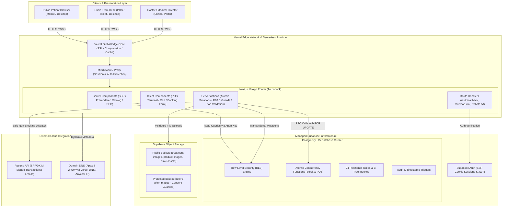

# Brimish Skin Care Clinic — Final Production Architecture

**System**: Integrated Aesthetic Skincare Clinic Website & Management Platform  
**Target Environment**: Next.js 16 (App Router / Turbopack) | Supabase PostgreSQL 15 | Resend | Vercel  
**Version**: 1.0.0-production  
**Date**: October 2026  
**Architect**: Principal Software Architect & DevOps Lead  

---

## 1. High-Level Architecture Diagram

---

## 2. Layer-by-Layer Architectural Breakdown

### 2.1 Presentation & Client Layer
- **Responsive Web Applications**: Single unified responsive Next.js application accommodating public visitors, clinic front-desk receptionists, and the medical director.
- **Client Primitives**: Accessible UI built with shadcn/ui and Radix UI primitives. Fully navigable via keyboard with WCAG 2.1 AA compliant color palettes.
- **State Management**: Zustand for the client-side retail shopping cart (`cart-store.ts`), React Hook Form + Zod for client/server validation.

### 2.2 Application Server Layer (Next.js 16 App Router)
- **Server Components (RSC)**: Prerendered public catalog pages (`/treatments`, `/products`, `/gallery`, `/about`), reducing client JavaScript bundle size and achieving sub-second First Contentful Paint.
- **Server Actions**: All mutation operations (POS checkout, patient creation, visit records, online booking, order status updates) execute server-side in isolated transactions.
- **Middleware & Security Proxy**: Intercepts requests to `/dashboard/*`, evaluates auth cookies via `@supabase/ssr`, and redirects unauthorized users to `/auth/login`.

### 2.3 Database & Storage Layer (Supabase PostgreSQL 15)
- **Relational Integrity**: 24 relational tables enforcing foreign keys with `ON DELETE RESTRICT` on financial records (invoices, sales, visits).
- **Concurrency Protections**:
  - `atomic_deduct_stock`: Row-level `FOR UPDATE` lock guarantees POS sales and visit product usage cannot cause negative inventory.
  - `atomic_reserve_stock`: Prevents concurrent overselling during simultaneous online checkouts.
- **Object Storage**: 4 categorized buckets with MIME type and size limits enforced both at the storage policy level and in Next.js server actions.

### 2.4 External Integration Layer
- **Resend**: Transactional emails dispatched via Resend API using SPF/DKIM signed domain (`brimishskincare.com`). Fail-safe architecture ensures that email outages never abort or roll back financial transactions.

---

## 3. Data Flow Pathways

### 3.1 Patient Booking Flow
1. Patient navigates to `/book`, selects treatment, enters contact info.
2. Zod validates payload; Server Action inserts record with status `pending`.
3. Anonymous client obeys RLS (cannot read internal clinic data).
4. Asynchronous email alert sent to clinic reception desk and logged in `email_logs`.

### 3.2 POS Clinical Sale Flow
1. Receptionist opens `/dashboard/pos`, selects patient, adds treatments and products.
2. Server Action calculates subtotal, caps discounts, computes tax, and calls `atomic_deduct_stock`.
3. Row lock acquired; stock decremented; movement logged in `inventory_movements`.
4. Invoice record generated with sequential number (`INV-YYYYMM-XXXX`).
5. Audit record created in `audit_log`.

### 3.3 Doctor Clinical Visit Flow
1. Doctor opens patient profile in `/dashboard/patients/[id]`.
2. Doctor records procedure observations and clinical notes.
3. Server Action verifies `staff.role === 'super_admin'` before saving.
4. Receptionists querying the patient profile receive masked clinical fields.
